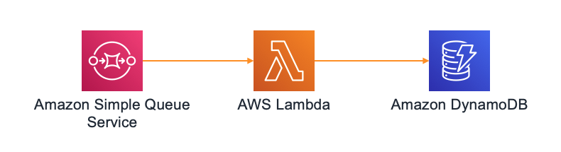

# Serverless using AWS SAM

This repository contains a simple application that gets defined and provisioned using AWS SAM.

For CI/CD it assumes there are two environments: staging and production.

## Architecture

Application is responsible for storing a message in a DynamoDB table through an Amazon Lambda function when it is dropped into an SQS queue.



## Requirements

* Node.js 12 or above
* npm 6 or above
* [AWS SAM CLI 0.40.0](https://docs.aws.amazon.com/serverless-application-model/latest/developerguide/serverless-sam-cli-install.html). It requires you to set AWS credentials so that it can make calls to AWS services on your behalf.
* Set the AWS region you want to deploy this application to. You can do so through `aws configure` or `AWS_DEFAULT_REGION` environment variable.

## Project Structure

AWS SAM template is defined in the root directory through a YAML file. It defines:

* An input `Parameter` that specifies to which environment we are going to be deploying to
* A `Condition` that based on the parameter above determines if this is a deployment to production or not. This is needed as different resources and configurations will be used based on the environment.
* `Global` section to define those parameters that are common to multiple resources in the template.
* `SQS` queue where new book events are sent to.
* Lambda function called `PutBookFunction` which is responsible for taking messages off the queue and storing them into DynamoDB. This component is the core of the application and hence, it is formed by the following configuration:
  * IAM Policies so it can receive messages from SQS and write them into DynamoDB table.
  * For staging, new versions are deployed to an alias named after the environment with a bluen/green approach.
  * For production, we use a more conservative approach that allows us to gradually shift traffic towards the new version. During the time this deployment lasts, a CloudWatch alarm (`AliasErrorMetricGreaterThanZeroAlarm`) is monitored so in case it throws errors, a rollback to the previous version is performed.
  * Lastly, deployments to both environments perform a check (or smoke test) for the new version before shifting traffic to it through a lambda function (`PreTrafficCheckFunction`). If it fails, traffic is not routed to the new version and deployment is considered failed.
* Aforementioned DynamoDB table: `Books`.

## Using SAM to deploy the app

Packaging and deploying the app to AWS is relatively straight forward since all configuration is defined in `template.yml`.

* Package your lambda functions and store them safely in a S3 bucket. This command outputs the corresponding version of your `template.yml` pointing to where your artifacts have been stored in S3.
  
  ```sh
  sam package --s3-bucket my-artifacts-bucket --s3-prefix my-prefix --output-template-file out.yml
  ```

* Deploy a new version of your app using the artifacts the command above just generated (using staging as the target environment for demo purposes):

  ```sh
  sam deploy --template-file out.yml --stack-name my-stack-staging --parameter-overrides ParameterKey=Environment,ParameterValue=staging --capabilities CAPABILITY_IAM
  ```

  You can monitor how the deployment is happening through AWS CodeDeploy as the above will create a new application in this service alongside a deployment group for your lambda.

These two commands will be usesd in both `Build` and `Deploy` steps of our pipeline.

## Testing your lambda locally

Create a docker network and run a local dynamodb container in it:

```sh
docker network create my-network
docker run -d --network my-network -v "$PWD":/dynamodb_local_db -p 8000:8000 \
    --network-alias=dynamodb --name dynamodb \
    amazon/dynamodb-local -jar DynamoDBLocal.jar -sharedDb
```

Create the following table in the local DynamoDB:

```sh
aws dynamodb create-table --table-name books \
    --attribute-definitions AttributeName=isbn,AttributeType=S \
    --key-schema AttributeName=isbn,KeyType=HASH \
    --endpoint-url http://localhost:8000 \
    --provisioned-throughput ReadCapacityUnits=5,WriteCapacityUnits=5
```

Check previous step ran successfully:

```sh
aws dynamodb list-tables --endpoint-url http://localhost:8000
aws dynamodb describe-table --table-name books --endpoint-url http://localhost:8000
```

Finally, test your function with a dummy event (that can be generated with `sam local generate-event sqs receive-message`):

```sh
TABLE=books sam local invoke "PutBookFunction" -e events/sqs_event1.json  --docker-network my-network
```

Notice that our lambda function will point to the local DynamoDB container for the command above through its HTTP layer. Condition is based on `AWS_SAM_LOCAL` which automatically gets set by `sam` when executing `local` commands.

A very similar approach using Docker will be taken to perform end-to-end tests for our lambda function and its integration with DynamoDB.

## Monitoring

AWS SAM CLI allows to monitor any lambda function given its logical id within a stack or its name as we would visualize them using Cloudwatch. For ie:

```sh
sam logs -n PutBookFunction --stack-name aws-serverless-app-staging --tail
```

## CI/CD

```sh
Source -> Build -> Test -> Deploy to Staging -> Deploy to Production (Manuall approval + Deploy)
```

Stages and actions are implemented using AWS CodePipeline, AWS CodeBuild and AWS CodeDeploy (behind the scenes through `sam deploy` command).

Pipeline itself is defined and provisioned by [AWS CDK](https://docs.aws.amazon.com/cdk/latest/guide/home.html) using Typescript.

To get it provisioned follow these steps:

* First, install AWS CDK tools:

  ```sh
  npm install -g aws-cdk
  ```

* Then, fetch dependencies and provision pipeline:

  ```sh
  cd pipeline
  npm i
  npm run build
  cdk deploy
  ```

  There will be a summary of security-related changes that needs to be approved to continue with the CloudFormation template creation.

NOTES:

* This step needs to be implemented only once when starting to work on this project.
* Artifacts generated by the pipeline are stored in an Amazon S3 bucket called `ci-cd-pipeline-artifacts`.
* Artifacts which are specific for our application are stored in an Amazon S3 bucket called `aws-serverless-app-artifacts`.
* Aforementioned buckets are created by our CDK script and hence, they cannot exist before running it.
* To successfully connect to Github:
  * Username is provided through a AWS SSM parameter called `github_username`,
  * Secret is provided through AWS Secrets Manager. Both secret name and field are called `github_token`.

## Want to contribute?

Check our [contribution guidelines](CONTRIBUTING.md) before submitting a pull request. Any contribution must be done to the `develop` branch.

## License

This library is licensed under the MIT-0 License. See the LICENSE file.
